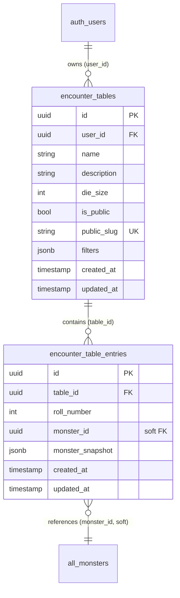

# Data Model - Random Encounter Tables

**Date**: 2025-10-22
**Feature**: Random Encounter Tables
**Status**: Complete

## Entity Definitions

### 1. encounter_tables

Primary entity representing a user's encounter table configuration.

**Fields**:

```typescript
interface EncounterTable {
  id: string; // UUID, primary key
  user_id: string; // UUID, foreign key to auth.users
  name: string; // 3-100 characters, required
  description: string | null; // max 500 characters, optional
  die_size: number; // integer, 2-1000, required
  is_public: boolean; // default false
  public_slug: string | null; // 8 characters, unique when not null
  filters: EncounterTableFilters; // JSONB, required
  created_at: Date; // timestamp with timezone
  updated_at: Date; // timestamp with timezone
}
```

**Constraints**:

- `name` length: 3-100 characters
- `description` length: max 500 characters
- `die_size` range: 2-1000 (enforced via CHECK constraint)
- `public_slug` uniqueness: unique index where not null
- `user_id` required (NOT NULL)

**Indexes**:

```sql
CREATE INDEX idx_encounter_tables_user_id ON encounter_tables(user_id);
CREATE UNIQUE INDEX idx_encounter_tables_public_slug ON encounter_tables(public_slug) WHERE public_slug IS NOT NULL;
CREATE INDEX idx_encounter_tables_created_at ON encounter_tables(created_at DESC);
```

**RLS Policies**: See Section 5 below

---

### 2. encounter_table_entries

Represents a single roll position on an encounter table with its associated monster.

**Fields**:

```typescript
interface EncounterTableEntry {
  id: string; // UUID, primary key
  table_id: string; // UUID, foreign key to encounter_tables
  roll_number: number; // integer, 1 to table.die_size
  monster_id: string | null; // UUID, soft reference to monsters (can be null if deleted)
  monster_snapshot: MonsterSnapshot; // JSONB, complete monster data at time of addition
  created_at: Date; // timestamp with timezone
  updated_at: Date; // timestamp with timezone
}
```

**Constraints**:

- `roll_number` range: 1 to parent table's die_size (application-level validation)
- Unique constraint: `(table_id, roll_number)` - each roll number appears once per table
- Unique constraint: `(table_id, monster_id)` where monster_id IS NOT NULL - no duplicate monsters per table
- `table_id` foreign key with CASCADE delete (entries deleted when table deleted)

**Indexes**:

```sql
CREATE INDEX idx_encounter_entries_table_id ON encounter_table_entries(table_id);
CREATE UNIQUE INDEX idx_encounter_entries_unique_roll ON encounter_table_entries(table_id, roll_number);
CREATE UNIQUE INDEX idx_encounter_entries_unique_monster ON encounter_table_entries(table_id, monster_id) WHERE monster_id IS NOT NULL;
```

**RLS Policies**: See Section 5 below

---

### 3. EncounterTableFilters (JSONB Type)

Stored filter configuration for table generation and regeneration.

**TypeScript Definition**:

```typescript
interface EncounterTableFilters {
  sources: MonsterSource[]; // ['official', 'user', 'public'], min 1 required
  level_min: number; // integer, 1-20, default 1
  level_max: number; // integer, 1-20, default 20, must be >= level_min
  alignments?: Alignment[]; // ['Lawful', 'Neutral', 'Chaotic'], optional
  movement_types?: MovementType[]; // ['fly', 'swim', 'burrow', 'climb'], optional
  search_query?: string; // max 100 characters, optional
}

type MonsterSource = "official" | "user" | "public";
type Alignment = "Lawful" | "Neutral" | "Chaotic";
type MovementType = "fly" | "swim" | "burrow" | "climb";
```

**Validation Rules**:

- `sources`: At least one source must be selected
- `level_min` <= `level_max`
- `search_query`: If provided, max 100 characters

**Zod Schema**:

```typescript
import { z } from "zod";

export const EncounterTableFiltersSchema = z
  .object({
    sources: z
      .array(z.enum(["official", "user", "public"]))
      .min(1, "At least one monster source required"),
    level_min: z.number().int().min(1).max(20).default(1),
    level_max: z.number().int().min(1).max(20).default(20),
    alignments: z.array(z.enum(["Lawful", "Neutral", "Chaotic"])).optional(),
    movement_types: z
      .array(z.enum(["fly", "swim", "burrow", "climb"]))
      .optional(),
    search_query: z.string().max(100).optional(),
  })
  .refine((data) => data.level_min <= data.level_max, {
    message: "Minimum level must be less than or equal to maximum level",
    path: ["level_min"],
  });
```

---

### 4. MonsterSnapshot (JSONB Type)

Complete monster data preserved at the time of table entry creation.

**TypeScript Definition**:

```typescript
interface MonsterSnapshot {
  // Core identification
  id: string; // Original monster UUID
  name: string;
  source: "official" | "user"; // Origin of monster

  // Core stats (Shadowdark format)
  challenge_level: number; // 1-20
  armor_class: number; // Typically 10-20
  hit_points: number; // Varies by CL
  hit_dice: string; // e.g., "4d8"
  speed: string; // e.g., "30 ft."
  movement_types: string[]; // e.g., ["fly", "swim"]

  // Ability scores
  str: number; // Strength
  dex: number; // Dexterity
  con: number; // Constitution
  int: number; // Intelligence
  wis: number; // Wisdom
  cha: number; // Charisma

  // Modifiers (derived from ability scores)
  str_mod: number;
  dex_mod: number;
  con_mod: number;
  int_mod: number;
  wis_mod: number;
  cha_mod: number;

  // Combat
  attacks: Attack[]; // JSONB array
  abilities: Ability[]; // JSONB array
  traits: string | null; // Special traits description

  // Metadata
  alignment: "Lawful" | "Neutral" | "Chaotic" | null;
  size: string | null; // e.g., "Medium", "Large"
  type: string | null; // e.g., "Undead", "Beast"
  description: string | null;
  lore: string | null;
  treasure: Treasure | null; // JSONB object

  // User-generated content fields (null for official monsters)
  user_id: string | null;
  is_public: boolean;
  icon_url: string | null;

  // Timestamps (for reference)
  created_at: Date;
  updated_at: Date;
}

interface Attack {
  name: string;
  bonus: number; // Attack roll bonus
  damage: string; // e.g., "1d8+2"
  damage_type: string; // e.g., "slashing", "piercing"
  range: string | null; // e.g., "melee", "30 ft."
  description: string | null;
}

interface Ability {
  name: string;
  description: string;
  usage: string | null; // e.g., "1/day", "Recharge 5-6"
}

interface Treasure {
  copper: number;
  silver: number;
  gold: number;
  items: string[]; // e.g., ["Potion of Healing", "Silver Ring"]
}
```

**Source Query**:

```sql
-- Snapshot is created by selecting from all_monsters view
SELECT
  id, name, source, challenge_level, armor_class, hit_points,
  hit_dice, speed, movement_types, str, dex, con, int, wis, cha,
  str_mod, dex_mod, con_mod, int_mod, wis_mod, cha_mod,
  attacks, abilities, traits, alignment, size, type,
  description, lore, treasure, user_id, is_public, icon_url,
  created_at, updated_at
FROM all_monsters
WHERE id = $1;
```

---

## Relationships



**Notes**:

- `monster_id` is a "soft" foreign key - no database constraint, allowing deletion of source monsters
- `monster_snapshot` JSONB preserves data integrity when monsters are modified/deleted
- CASCADE delete: When table deleted, all entries automatically deleted

---

## State Transitions

### Encounter Table Lifecycle

```
[Draft] ─(user clicks "Generate")→ [Generated]
   ↓
[Generated] ─(user clicks "Make Public")→ [Public]
   ↓
[Public] ─(user clicks "Make Private")→ [Generated]
   ↓
[Generated/Public] ─(user clicks "Regenerate")→ [Generated/Public]
   ↓
[Any State] ─(user clicks "Delete")→ [Deleted]
```

**State Rules**:

- **Draft**: Table exists but has no entries (edge case - normally generation happens immediately)
- **Generated**: Table has entries, is_public = false
- **Public**: Table has entries, is_public = true, public_slug set
- **Deleted**: Table and all entries removed from database (hard delete)

### Entry Update Flows

```
[Entry with Monster A] ─(user clicks "Replace Random")→ [Entry with Monster B]
                       ─(user searches for Monster C)→ [Entry with Monster C]

[Entry exists] ─(source monster deleted)→ [Entry exists with snapshot]
```

**Update Rules**:

- Replacing entry creates new snapshot of new monster
- Original monster deletion does not affect entry (snapshot preserved)
- monster_id becomes stale reference (null or orphaned UUID)

---

## Database Schema (SQL)

```sql
-- ============================================
-- Table: encounter_tables
-- ============================================
CREATE TABLE encounter_tables (
  id UUID PRIMARY KEY DEFAULT gen_random_uuid(),
  user_id UUID NOT NULL REFERENCES auth.users(id) ON DELETE CASCADE,
  name VARCHAR(100) NOT NULL CHECK (char_length(name) >= 3),
  description VARCHAR(500),
  die_size INTEGER NOT NULL CHECK (die_size >= 2 AND die_size <= 1000),
  is_public BOOLEAN NOT NULL DEFAULT false,
  public_slug VARCHAR(8) UNIQUE,
  filters JSONB NOT NULL,
  created_at TIMESTAMPTZ NOT NULL DEFAULT now(),
  updated_at TIMESTAMPTZ NOT NULL DEFAULT now()
);

-- Indexes
CREATE INDEX idx_encounter_tables_user_id ON encounter_tables(user_id);
CREATE UNIQUE INDEX idx_encounter_tables_public_slug ON encounter_tables(public_slug) WHERE public_slug IS NOT NULL;
CREATE INDEX idx_encounter_tables_created_at ON encounter_tables(created_at DESC);

-- Updated timestamp trigger
CREATE TRIGGER update_encounter_tables_updated_at
  BEFORE UPDATE ON encounter_tables
  FOR EACH ROW
  EXECUTE FUNCTION update_updated_at_column();

-- ============================================
-- Table: encounter_table_entries
-- ============================================
CREATE TABLE encounter_table_entries (
  id UUID PRIMARY KEY DEFAULT gen_random_uuid(),
  table_id UUID NOT NULL REFERENCES encounter_tables(id) ON DELETE CASCADE,
  roll_number INTEGER NOT NULL,
  monster_id UUID, -- Soft reference (no FK constraint)
  monster_snapshot JSONB NOT NULL,
  created_at TIMESTAMPTZ NOT NULL DEFAULT now(),
  updated_at TIMESTAMPTZ NOT NULL DEFAULT now(),

  -- Constraints
  CONSTRAINT unique_roll_per_table UNIQUE (table_id, roll_number),
  CONSTRAINT unique_monster_per_table UNIQUE (table_id, monster_id) WHERE monster_id IS NOT NULL,
  CHECK (roll_number >= 1)
);

-- Indexes
CREATE INDEX idx_encounter_entries_table_id ON encounter_table_entries(table_id);
CREATE INDEX idx_encounter_entries_roll_number ON encounter_table_entries(table_id, roll_number);

-- Updated timestamp trigger
CREATE TRIGGER update_encounter_entries_updated_at
  BEFORE UPDATE ON encounter_table_entries
  FOR EACH ROW
  EXECUTE FUNCTION update_updated_at_column();
```

---

## Row Level Security (RLS) Policies

### encounter_tables Policies

```sql
-- Enable RLS
ALTER TABLE encounter_tables ENABLE ROW LEVEL SECURITY;

-- SELECT: Users can view their own tables
CREATE POLICY "Users can view own tables"
ON encounter_tables FOR SELECT
USING (user_id = auth.uid());

-- SELECT: Anyone can view public tables
CREATE POLICY "Anyone can view public tables"
ON encounter_tables FOR SELECT
USING (is_public = true);

-- INSERT: Users can create tables (enforce ownership)
CREATE POLICY "Users can create own tables"
ON encounter_tables FOR INSERT
WITH CHECK (user_id = auth.uid());

-- UPDATE: Users can only update their own tables
CREATE POLICY "Users can update own tables"
ON encounter_tables FOR UPDATE
USING (user_id = auth.uid())
WITH CHECK (user_id = auth.uid());

-- DELETE: Users can only delete their own tables
CREATE POLICY "Users can delete own tables"
ON encounter_tables FOR DELETE
USING (user_id = auth.uid());
```

### encounter_table_entries Policies

```sql
-- Enable RLS
ALTER TABLE encounter_table_entries ENABLE ROW LEVEL SECURITY;

-- SELECT: Users can view entries for tables they can access
CREATE POLICY "Users can view entries for accessible tables"
ON encounter_table_entries FOR SELECT
USING (
  EXISTS (
    SELECT 1 FROM encounter_tables
    WHERE id = encounter_table_entries.table_id
    AND (user_id = auth.uid() OR is_public = true)
  )
);

-- INSERT: Users can create entries for their own tables
CREATE POLICY "Users can create entries for own tables"
ON encounter_table_entries FOR INSERT
WITH CHECK (
  EXISTS (
    SELECT 1 FROM encounter_tables
    WHERE id = encounter_table_entries.table_id
    AND user_id = auth.uid()
  )
);

-- UPDATE: Users can update entries in their own tables
CREATE POLICY "Users can update entries in own tables"
ON encounter_table_entries FOR UPDATE
USING (
  EXISTS (
    SELECT 1 FROM encounter_tables
    WHERE id = encounter_table_entries.table_id
    AND user_id = auth.uid()
  )
)
WITH CHECK (
  EXISTS (
    SELECT 1 FROM encounter_tables
    WHERE id = encounter_table_entries.table_id
    AND user_id = auth.uid()
  )
);

-- DELETE: Users can delete entries from their own tables
CREATE POLICY "Users can delete entries from own tables"
ON encounter_table_entries FOR DELETE
USING (
  EXISTS (
    SELECT 1 FROM encounter_tables
    WHERE id = encounter_tables.id
    AND id = encounter_table_entries.table_id
    AND user_id = auth.uid()
  )
);
```

---

## Query Patterns

### 1. Create Table with Entries

```typescript
// Step 1: Create table
const { data: table, error: tableError } = await supabase
  .from("encounter_tables")
  .insert({
    user_id: userId,
    name: "Forest Encounters",
    description: "Random encounters for Darkwood Forest",
    die_size: 20,
    filters: {
      sources: ["official", "public"],
      level_min: 3,
      level_max: 7,
      alignments: ["Neutral", "Chaotic"],
      movement_types: [],
      search_query: "",
    },
  })
  .select()
  .single();

// Step 2: Query monsters matching filters
const { data: monsters } = await supabase
  .from("all_monsters")
  .select("*")
  .gte("challenge_level", 3)
  .lte("challenge_level", 7)
  .in("alignment", ["Neutral", "Chaotic"])
  .order("random()")
  .limit(20);

// Step 3: Create entries with snapshots
const entries = monsters.map((monster, index) => ({
  table_id: table.id,
  roll_number: index + 1,
  monster_id: monster.id,
  monster_snapshot: monster,
}));

await supabase.from("encounter_table_entries").insert(entries);
```

### 2. Roll on Table

```typescript
// Generate random roll (1 to die_size)
const rollResult = Math.floor(Math.random() * dieSize) + 1;

// Fetch entry for that roll
const { data: entry } = await supabase
  .from("encounter_table_entries")
  .select("roll_number, monster_snapshot")
  .eq("table_id", tableId)
  .eq("roll_number", rollResult)
  .single();

// Display monster from snapshot (no additional query needed)
return entry.monster_snapshot;
```

### 3. Make Table Public

```typescript
import { nanoid } from "nanoid";

async function makeTablePublic(tableId: string) {
  let slug: string | null = null;
  let attempts = 0;
  const maxAttempts = 5;

  while (attempts < maxAttempts) {
    slug = nanoid(8);

    const { data, error } = await supabase
      .from("encounter_tables")
      .update({ is_public: true, public_slug: slug })
      .eq("id", tableId)
      .eq("user_id", auth.uid())
      .select();

    if (!error) return data[0];

    // Check if error is due to slug collision
    if (error.code === "23505") {
      // Unique violation
      attempts++;
      continue;
    }

    throw error;
  }

  throw new Error("Failed to generate unique public slug");
}
```

### 4. Copy Public Table

```typescript
async function copyPublicTable(publicSlug: string, newUserId: string) {
  // Fetch original table
  const { data: originalTable } = await supabase
    .from("encounter_tables")
    .select("*, encounter_table_entries(*)")
    .eq("public_slug", publicSlug)
    .eq("is_public", true)
    .single();

  // Create new table (not public, no slug)
  const { data: newTable } = await supabase
    .from("encounter_tables")
    .insert({
      user_id: newUserId,
      name: `${originalTable.name} (Copy)`,
      description: originalTable.description,
      die_size: originalTable.die_size,
      is_public: false,
      public_slug: null,
      filters: originalTable.filters,
    })
    .select()
    .single();

  // Copy all entries
  const newEntries = originalTable.encounter_table_entries.map((entry) => ({
    table_id: newTable.id,
    roll_number: entry.roll_number,
    monster_id: entry.monster_id,
    monster_snapshot: entry.monster_snapshot,
  }));

  await supabase.from("encounter_table_entries").insert(newEntries);

  return newTable;
}
```

---

## Validation Rules Summary

### encounter_tables

- `name`: 3-100 characters, required
- `description`: max 500 characters, optional
- `die_size`: 2-1000, required
- `filters.sources`: At least 1 source, required
- `filters.level_min`: 1-20, must be <= level_max
- `filters.level_max`: 1-20, must be >= level_min
- `public_slug`: 8 characters (when set), globally unique

### encounter_table_entries

- `roll_number`: 1 to parent table's die_size
- `table_id`: Must reference existing table
- `monster_snapshot`: Complete monster data, required
- Uniqueness: One entry per roll number per table
- Uniqueness: No duplicate monsters (monster_id) per table

---

## Migration Dependencies

**Required Existing Tables**:

- `auth.users` (Supabase Auth)
- `official_monsters` OR `all_monsters` view
- Helper function: `update_updated_at_column()` (timestamp trigger)

**New Tables**:

1. `encounter_tables` (no dependencies)
2. `encounter_table_entries` (depends on encounter_tables)

**Order**:

```sql
-- 1. Create encounter_tables
-- 2. Create encounter_table_entries (references encounter_tables)
-- 3. Create RLS policies for both tables
```
